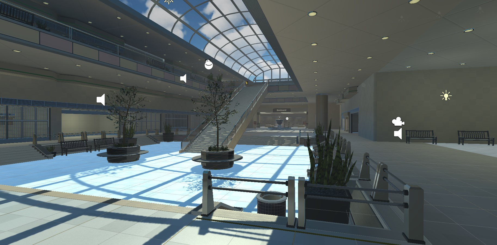
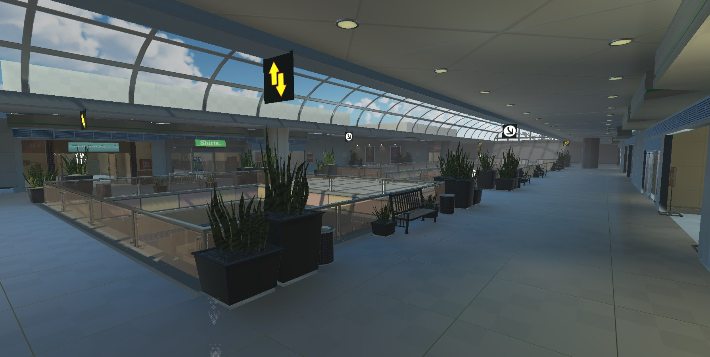
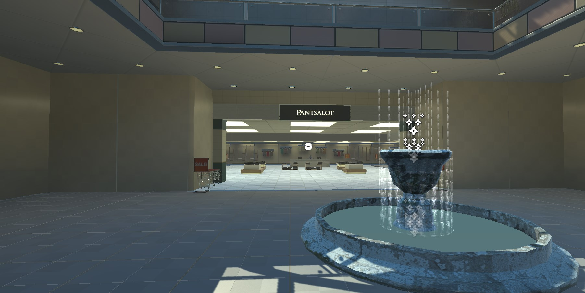

# Discrimination
  
   ## Table of Contents
  * [Description](#description)
  * [Team](#team)
  * [Overview](#overview)
  * [Rationale](#rationale)
  * [Development](#development)
  * [Organization](#organization)
  * [Evaluation](#evaluation)
  * [Responsibilities](#responsibilities)
  * [Sneak-Peek](#sneak-peek)
  * [Contributing](#contributing)
  
  
  ## Description
Below is the 11 page paper written to the clients for the Project Based (XLAB 400) class, detailing the work that will be put in, planned additions and its ethical decisions. On April 30th, 2021, the team will be presenting this project during the Ignite event.

  ## Team
St. Thomas Aquinas College

Taulant Xhakli (Unity Developer & Project Manager)

Makendy Midouin (Dialogue Implementation & Communication)

Justin Rosenberg (Reasearcher & Social Psychologist)

Michael Sakmann (Animations & Scene Building)

Jade Alexis Westhoven (Web Designer & Arts)

  ## Overview
This study is aimed to investigate and treat discrimation in the daily life of college students with the use of virtual reality. Specifically, this study will focus on collecting reactions to the normalized bias’ of race, gender, and weight. The proposed study will use around 60 college aged students who are registered at St. Thomas Aquinas College. Students will be volunteers who are willing to participate in the virtual reality forum. Students will be asked to use the virtual reality headset to put themselves in someone else’s shoes. As they enter the virtual reality they will be dropped into a mall scenario. 
In this mall they will be able to wander the halls, and enter three respective rooms. The first room will be a dance studio where the students will be tested on their underlying bias against weight. The second room will be a clothing store in which  levels of racial descrimination will be tested. The final room will be a movie theater in which the researchers are looking to find a hidden bias against gender. When completed, this can help bring awareness to the user of their possible bias and help them grow from their experiences.  

  ## Rationale
It is generally accepted that unchecked bias is a negative force within each of us. Our bias becomes a problem when we allow it to take control of our conscious thoughts and influence the ways in which we treat others, making this unjust treatment of others discrimination. The goal of this project is to point out the ways that unconscious bias affects each individual, and to possibly use virtual reality to put them in the scenario of discrimination. The question posed as researchers is how can people enhance their empathy for others with the use of technology? This starts with bringing awareness to the ways our bias’ affect each other. 
By allowing the users to experience a 1st person view of the targeted groups, in turn will hopefully help the user learn to be empathic and not just limit their outward discrimation toward these groups but also be able to recognize and prevent others from doing the same. Whereas experiencing the scenes in a 3rd person perspective would, as studies show, not impact them as much as when being confronted with discriminatory remarks. If successful, it can prove to be significant as this can help change and minimize the unconscious behaviors that people use when interacting with each other. 

  ## Development
The main research question this project aims to answer is how can technology be used to adjust the outward discrimination found in people? As it has been mentioned in the previous paragraphs, there will be different scenes throughout the mall. Before the user is able to walk around the mall and experience each room they will be presented with a pop up form as they enter the virtual world. This pop up will be used to collect information by using the questions to test their unconscious bias for each of the selected discriminations as well as information such as their age, gender, etc. The general information will be used later to create overall statistics. With different users, there will be different outcomes. The goal is to make this experience as realistic as possible. The experiment is designed to highlight the underlying bias individuals have and to help the participants learn to be more empathic not only towards the targeted groups, but to everyone. The project will ideally consist of 30 participants in the experimental condition and 30 participants in the control condition. 
The first room is a dance studio where the user will be struggling to make it through the class due to their weight. No matter how hard the participant tries to keep up, the user will run out of stamina. This symbolizes the limitations that people who are overweight may have.  At the end of this session a person will approach the user and make mean comments about their weight. The participant will not know why this is happening, but the goal is they will display higher levels of empathy after experiencing this situation.
The second room is a clothing store. In this room the user will experience discrimination based on race. The user will be a minority and will be given prompts on where to roam around the store to look for clothes. One of the NPC’s will be a white female store worker who constantly stares at the user and suspects them of shoplifting. Eventually, the user will be approached by a security guard and kicked out of the clothing store. Once the user walks out of the store they will look into a mirror that reveals their identity. As experimenters, the goal is to make sure the user knows they are being kicked out of the store because they are being discriminated against due to their race. Their skin color is the only difference between the other customers who will be doing the same thing. 
The third room is a movie theater. In this room the user will experience gender discrimination. The user will be a woman who buys a movie ticket for herself and the ticket clerk will be a man. The ticket clerk will ask the woman uncomfortable questions regarding why she is buying the movie ticket and why she is alone. The focus in this room is to show ways women can be discriminated against in public settings. 
Researchers will measure levels of prejudice in the participants through questionnaires both before and after they have run through the simulations. The questionnaires will be acquired for research purposes only and are available in peer-reviewed publications.  The goal is that the participants will display higher levels of empathy in their post-simulation responses as compared to their responses before running through the simulation. The participants will then be read a debriefing after they have taken off the headset. 
One idea for the control condition is to have the participants in this condition run through the simulation in a 4th room where there will be no discrimination being displayed. Another idea is to have the participants in this condition run through a completely different project and not through this simulation at all. These ideas are still being discussed and are not finalized yet. 
As for the technical aspect of each room, each room will have a variety of high-poly NPCs with animations that are both Mixamo stock and created through motion-capture. For the mall, both scenes and filler rooms needed improvement on their design choice and look. Such as fixing the lighting and adding an entrance with a garage are just a few additions to improve the quality of the mall. NPCs also roam the mall’s center and top floor by the NavMesh path implemented to their walking scripts and animations. Some NPCs can be found having a conversation with another, or sitting on the benches scattered around to breathe life into the VR environment. Small implementations to help fill the quiet void of the scenes are authentic mall background noise and music to tie in with the discrimination topic, as well as a working theater with a 3D Plane to project the video and audio of the film. However, despite realism being our top priority, seeing as this is an unconscious bias test, the user’s hands will be a slightly transparent light blue color to not give away their gender or skin color until intended. This was done by using the built-in Oculus VR hand anchors and applying a custom hand prefab to each without adding a new texture.
For each scene, as the user is going through the discrimination trail, there will need to be a way for them to reveal to themselves the identity they have been experiencing the scene as. For example, the theater scene will have the user be directed to the bathroom and look at the mirror to see they have been talking to the clerk as a woman. This has been done by adding another room near the theater, all textured and modeled to look like a private bathroom. Seeing as the VR hands are not detailed, this allows the development team to express some creativity in doing the reveal for the ending of the scene. The door of the bathroom will be used as a scene entry, just as the Dance Studio will be. The user will load into the bathroom scene, once collided with the door with their 3D model and hands change accordingly to what will be intended. This was decided due to having a real-time 3D model change for the VR controller proving difficult, so this idea was presented as an improvisation. As for the bathroom itself and how the mirroring will work, the plane will have a reflection probe attached and display the reflection of the room to the plane in real-time. With the probe refreshing every frame and no time splicing, it will display on the plane as smooth as possible. From there, the user will be able to see their new attached model in the mirror and realize who the NPC was talking to in the scenario and make the user think about what just transpired in a new perspective. 
For the other scenes, the premise of how the user’s identity will be presented remains relatively the same, consisting of mirrors that they will see themselves in after the scene is finished. As for the main NPCs in each scene, they will contain audio scripts with an array of audio files to be used in the conversations that will take place. Other filler NPCs around the mall that are having conversations will have audio files to simulate realistic conversations, but will be at a lower volume. This way the user is not overwhelmed by the amount of audio present in the theater. 
Small quality of life improvements to be made to the project before the final build is to maintain a constant +60fps while in VR. Having a low framerate will surely take the user out of the experience, but also cause eye irritation. Animations need to be smooth and not be repeated unless the animation is longer than a minute or so. One quality of life change that was a bother in the mall’s early development was the skybox and the lighting direction, as it was not realistic nor fit the mall’s style. Implementing an HD daytime skybox and repositioning the directional light based on the skybox keeps the mall scene looking realistic. Nitpicks such as that are important to look for, as the smallest details done standout for the better.

  ## Organization
Maintaining a mutual relationship with the group and focusing on the tasks to be completed is an important step to finalize a project of this size. Which is why SCRUM plays a vital role in the development of the project and the steps it takes when putting together ideas. For the entirety of the project, the most important SCRUM aspect to be used repetitively is organization. Constant organization such as meetings, and dividing the work between each other, even keeping track of any changes made to the VR is what allows a project to be done quickly and efficiently. This takes people out of their comfort zone, and helps develop the leadership skills necessary to succeed. A facet of SCRUM that feeds off of the organizational aspect is the business justification. When organizing a project in its early stages, it is imperative that everyone understands what the most important parts of the project are as well as knowing what needs to be finished in a timely manner. Taking too long on something that does not have much value to the project would disrupt the workflow and puts the project in jeopardy. 
The consistent hard work maintained by the development team is prominent in every facet of this project.  The progress of each room and their individual topics should remain consistent to the others.. If one room were to be more developed than the other, the quality of the project would be put into question, taking the user out of the VR experience. 
	Projects always start out with lots of innovative ideas and high expectations, but it is a good idea to keep track of any inevitable changes. If an idea becomes more difficult than anticipated, there is nothing wrong with changing it to something more doable in the allotted time; it may even be better than what was originally expected. Change does not have to just be within the project it can also be projected to the ways a person works and receives feedback, or contributes to the group’s projects. If there are people doing too much work or too little, adjustments can be made to keep the workflow smooth so that everyone is involved equally. 
	Risk is an important aspect in maintaining the progress of a team working in VR. It can be used to see if there are any changes to be made that are too demanding or that do not fit in the time restrictions. Perhaps those adjustments can prove useful in justification and increase the quality of the project. Working with serious topics, such as discrimination, is a risk already. It is hard to tell how people are going to react to the information as well as the project as a whole. 
	Maintaining reachable goals and deadlines are an important step when working as a group. Our project schedule consists of goals from the discrimination side as well as goals from the technical side. Right now the top priority is to find ways to accurately measure levels of prejudice in the users. These surveys and questionnaires will be pulled from peer-reviewed publications. It is necessary for the researchers to have multiple options to pull different types of questions from, and to also make sure the questions are worded up to date. The researchers will be looking for ways to measure the three types of discrimination being covered in the project; African Americans, obese/overweight people, and women. After these measures are found there are other questions the researchers would like to include in the questionnaires that would help to better understand all of the results. Some of these the researches have are “Do we include measures of how transporting the VR experience is?”, “Do we include measures of suspicion about the hypothesis?”, “Do we include measures of demographics? - How to deal with people who are already in the assigned stigmatized groups”. Simultaneously, the tech team will be improving the scene rooms, as well as the 4th room that will be used for the control condition. Participants in this condition will run through the 4th room that does not display any type of discrimination at all. After carefully thinking about and designed the specific questions that will be used to measure prejudice, the next steps will be to begin running participants through the project and obtaining results. It is important for the researchers to keep in mind that the presentation for the project will be some time in late April, so keeping up with goals and deadlines is important to the success of the project and the group. 

  ## Evaluation
The easiest way to evaluate a project is to constantly test throughout the development process. From making sure the program runs smoothly when built to testing the visuals and mechanics with the VR headset whenever an addition has been made, every facet needs to be tested constantly; as well as creating back-ups of the project, both on an online server and locally, to ensure that there is a fail-safe when necessary. Seeing as each scene has an object that is interactable as well as NPCs that will be speaking, it is imperative that the development team tests these scenarios in the VR environment in awkward positions as a way to see if it works, no matter the position. It is important to make sure the user has little to no way of breaking the flow of what was intended in the scene, or else the project will not be presented or received well.
	As long as the project ends with a good reception from a social science perspective, in regards to testing biases, then the project will be a success. Especially the subjects who will be put through trial of the VR experience, if their intuition for the scenarios are from the lack of depth or poor execution, rather than the intuition of the subject they are experiencing, the project ends up pointless for the testers. There needs to be a sense of realism and immersion in the mall, as well as high quality NPC interaction, in order for the project to be deemed finished.

  ## Responsibilities 
  | Member | Tasks |
  | :---: | :---: |
  | Taulant | Maintaining the workflow between each room throughout the semester. This includes managing the project’s file size to a minimum and keeping the frame rate higher. Will also be continuing work on each scenes “reveal” sections with mirroring and room additions. Adding new NPCs and designing all of the non-discrimination stores, as well as the 4th controlled room. Designing the entrance of the dance hall to indicate to the user that it is there, as right now the door is hidden in the back. Will also add the new improved NPCs with new animations for them to walk around the mall and the store scene.|
  | Justin | Next step responsibilities include finding accurate ways to measure the three types of prejudice that will be tested in the project. Once that is completed, I will incorporate some of the other research questions we have into the surveys and finalize all of the questions to be ready to run participants through. |
  | Michael | Will be working with the audio of the mall and the implementation of animations for Theater and Dance Studio NPCs. |
  | Makendy | Will be working on the voice implementation to the main NPCs and conversation scripts for the user and the NPC. Will also be working with Michael for the Dance Studio on the Motion-Capture implementation. |
  | Jade Alexis | I will be editing and adding to the XLAB website; such as making the project more presentable and eye catching for the students at the college and talking about projects the team has worked on in the past. Also, I will assist the team in other aspects of the project as well. |

  
  ## Sneak-Peek
 
  
  
  
  
  

  
  ## Contributing
  
  Contributions are always accepted. This is an on-going project that anyone in the future can use and implement new ideas.
